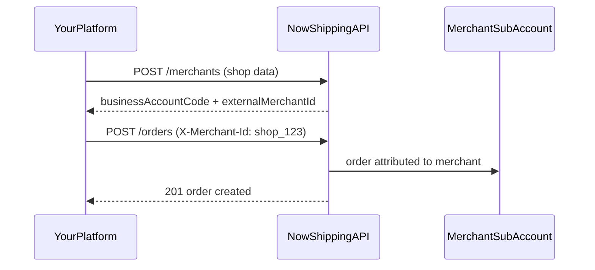

The Now Shipping multi-tenant model lets you run a single integration that serves every shop on your platform. Instead of issuing one API key per merchant, you create a **company account** — a top-level account flagged as `isCompanyAccount: true` — and attach any number of merchant sub-accounts to it. A single `nsk_live_...` key authenticates all traffic, and the `X-Merchant-Id` header tells the API which merchant each request belongs to.

## Account types

Now Shipping distinguishes between two account types.

**Single business account** — A standard merchant account. The API key is tied directly to that business; no `X-Merchant-Id` is needed or accepted.

**Company account** — A multi-tenant integrator account (`isCompanyAccount: true`). Designed for e-commerce SaaS platforms, aggregators, or any system that manages shipping on behalf of multiple merchants. Each merchant you onboard becomes a sub-account linked to your company via the `parentCompany` relationship. One API key serves **all** merchants under the company.

<Info>
  Contact your Now Shipping account manager to have your account flagged as a company account before you start onboarding merchants.
</Info>

## How X-Merchant-Id works

On every order and pickup request made with a company key, include the `X-Merchant-Id` header to identify the target merchant. The API accepts three identifier formats:

| Value | Example |
|-------|---------|
| `businessAccountCode` | `48291736` |
| `externalMerchantId` | `shop_123` |
| MongoDB `_id` | `66f1a2b3c4d5e6f7a8b9c0d1` |

You can also pass the identifier as a query parameter instead of a header:

```bash
?merchantId=48291736
```

Use whichever format aligns with what you stored during merchant onboarding. Most integrations use `externalMerchantId` because it maps directly to the shop ID in their own database.

## Behavior by account type

| Account type | X-Merchant-Id | Behavior |
|--------------|---------------|----------|
| Single business | Not required | Key operates on that business directly |
| Company account | **Required** on orders/pickups | Resolves merchant sub-account per request |
| Company account | Optional on `/fees/calculate` | Uses company pricing if omitted; merchant pricing if set |

## Request flow

The sequence below shows how a typical platform onboards a new shop and places its first order:



## Recommended data mapping

Map your internal IDs to Now Shipping identifiers as soon as you onboard a merchant. Persist both `businessAccountCode` and `externalMerchantId` in your database so you always have a fallback identifier.

```text Recommended data mapping
Your Platform DB          Now Shipping API
─────────────────         ─────────────────
shop_id        ───────►   externalMerchantId (on onboard)
shop_id        ───────►   X-Merchant-Id (on orders/pickups)
order_id       ───────►   referralNumber (on create order)
order_number   ◄───────   orderNumber (from response)
awb_pdf        ◄───────   GET /orders/{n}/awb
```

## Error codes

If you send a company key without a required `X-Merchant-Id`, or use an identifier that isn't linked to your company, the API returns one of these errors:

| Error code | Cause |
|------------|-------|
| `MERCHANT_REQUIRED` | Company key used on an order/pickup route without `X-Merchant-Id` |
| `MERCHANT_NOT_FOUND` | The provided ID doesn't exist or isn't linked to your company |
| `MERCHANT_NOT_APPLICABLE` | `X-Merchant-Id` sent on a single-business API key |

<Warning>
  Never send `X-Merchant-Id` on a single-business key. The API rejects it with `MERCHANT_NOT_APPLICABLE` rather than silently ignoring it.
</Warning>

## Next steps

- To onboard a new merchant sub-account, see [Create Merchant](/api/merchants/create).
- To understand which scopes your key needs for merchant operations, see [API Key Scopes](/concepts/api-key-scopes).
